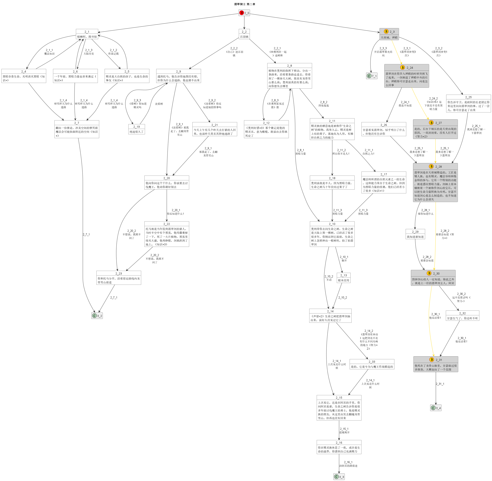
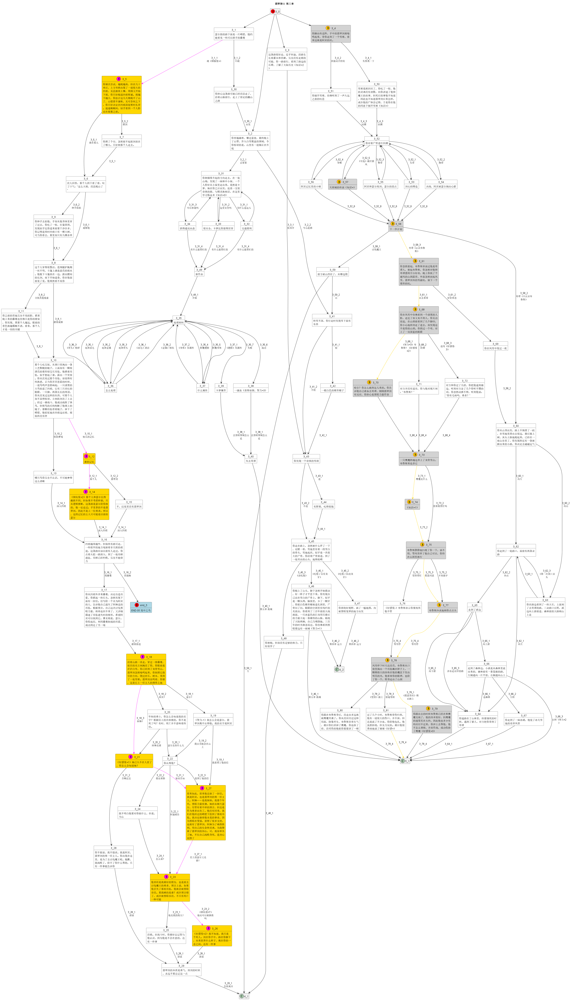
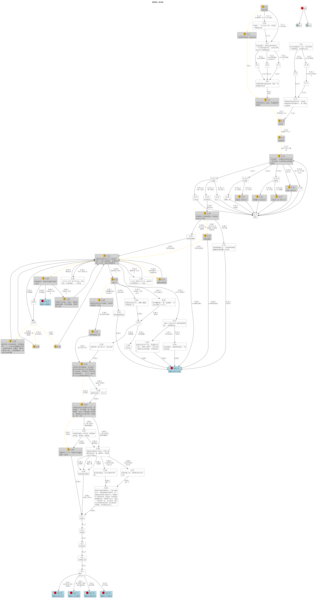
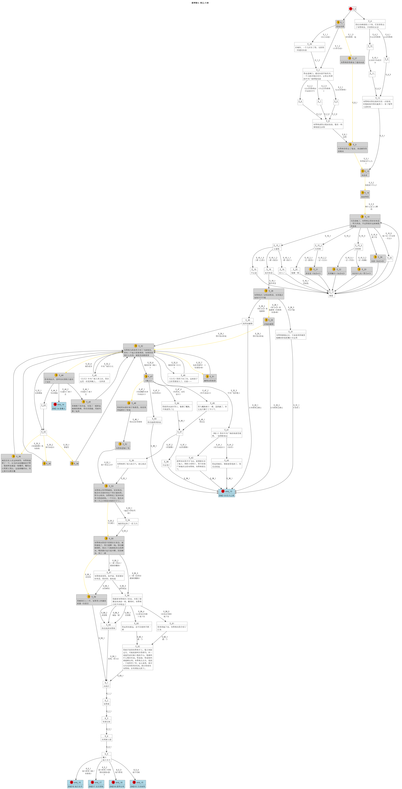

# 攻略

    
一图版

    

    
分章节版

    

        
第一章

        
    

    

        
第二章

        
    

    

        
第三章

        
    

    

        
第四章

        
    

    

        
第五、六章

        
    

<!-- java -DPLANTUML_LIMIT_SIZE=16384 -jar C:\ProgramData\chocolatey\lib\plantuml\tools\plantuml.jar -charset UTF-8 -Xml1024m EmeraldKnight-part.puml -->